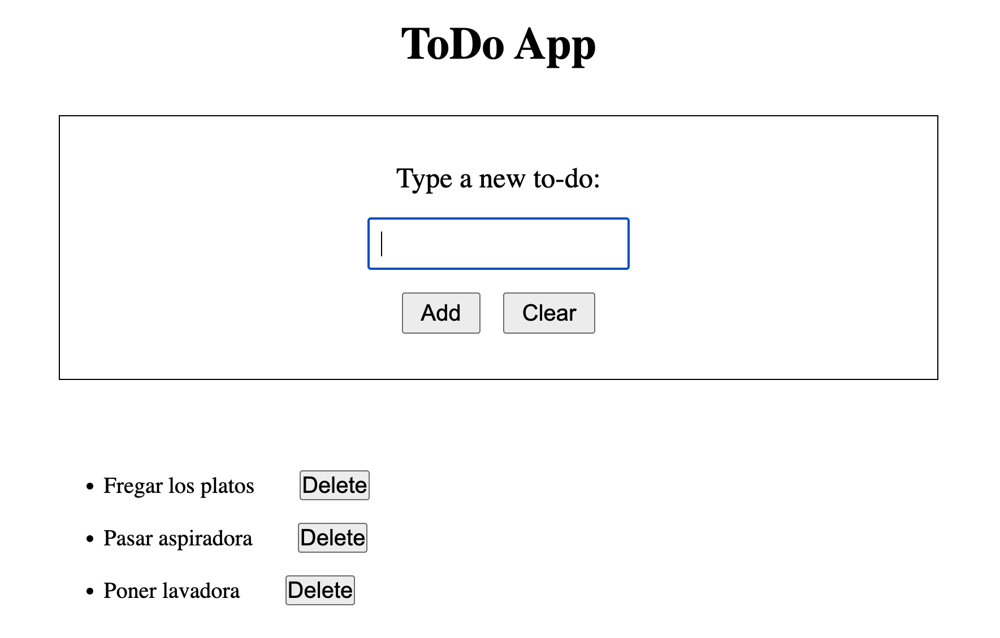

# To Do App
La tarea de este ejercicio consiste en construir una "to do app", es decir, una aplicación para registrar tareas pendientes. Al final del ejercicio tienes una imagen orientativa de cuál sería el resultado final (la imagen es orientativa, se admiten cambios estilísticos o aumentos en las funcionalidades).

## Descripción
La aplicación tendrá un formulario con un sólo `input` para que el usuario introduzca su tarea pendiente. Cuando el usuario pulse en el botón de "Add" o "Añadir", aparecerá en el DOM un elemento con el texto introducido por el usuario y un botón de "Delete" o "Eliminar". Las tareas se irán acumulando una debajo de la otra según se vayan escribiendo.
Cuando se pulse el botón de "Eliminar" de una tarea, ésta debe desaparecer del DOM.
Del mismo modo, cuando se pulse sobre el botón de "Clear" o "Limpiar", se eliminarán **todas** las tareas.

## Iteraciones
Es importante que no tratemos de abordar los poryectos de golpe y sin planificación, sino que debemos tratar de ir resolviendo las tareas una a una. Por ello, deberéis ir construyendo la aplicación en las siguientes fases:

1. **MVP** (*Minimum Viable Product*  o Producto Mínimo Viable): lo primero que necesitamos cuando estamos construyendo una aplicación es tener cuanto antes una aplicación que cumpla con las tareas básicas. En este caso, la primera fase de vuestro trabajo es conseguir que, cuando se introduzca una tarea, ésta aparezca en el DOM. Dado que es una aplicación de tareas pendientes, esta es la funcionalidad mínima necesaria paar que la aplicación tenga sentido.
2. **Delete button**: una vez hayamos conseguido lo anterior, debemos tratar de añadir a cada tarea un botón de "Delete" o "Eliminar" que, al pulsarlo, elimine la tarea del DOM. Es importante que el botón elimine la tarea a la que está unido, y no cualquier otra, ni todas.
3. **Clear button**: a continuación, sería necesario programar el botón de "Clear" para que, cuando se pulse, elimine todas las tareas.
4. **Validaciones**: cuando hayamos terminado lo anterior, sería adecuado introducir algunas validaciones al formulario, de manera que no se nos cuelen, por ejemplo, strings vacíos.
5. **Freestyle**: en este punto la aplicación ya estaría terminada, y, si tienes tiempo y ganas, podrías pensar en añadir funcionalidades nuevas que creas que faltan en la aplicación (este paso es opcional, por si no había quedado claro).

